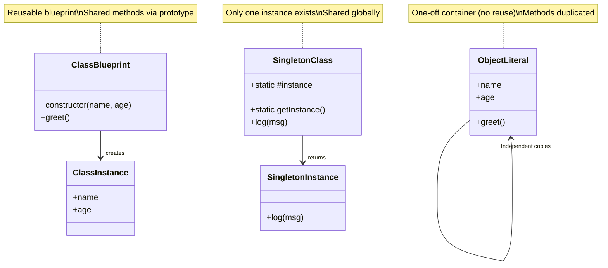

Got it 👍 — here’s a polished **chapter-style rewrite** of your notes, reorganized for flow and readability, with a stronger focus on object literals, classes, singletons, and private values.

---

# 📘 Chapter: Objects, Classes, and Singletons in JavaScript

## Introduction

JavaScript offers multiple ways to organize data and behavior. At the simplest level, you can use **object literals** (one-off containers), while **classes** provide reusable blueprints for creating multiple instances with shared methods.

On top of that, JavaScript classes also support **singleton patterns**, where a single instance or static value is shared across all usages. Understanding when to use plain objects, classes, or singletons will help you design code that is both efficient and maintainable.

---

## Objects vs Classes

### Quick Comparison

| Feature           | Plain Object (Literal)    | Class (Blueprint)           |
| ----------------- | ------------------------- | --------------------------- |
| Blueprint / Reuse | ❌ No                      | ✅ Yes                       |
| Shared Methods    | ❌ Duplicated per object   | ✅ Shared via prototype      |
| Memory Efficiency | ⚠️ Inefficient with many  | ✅ Efficient with many       |
| Best Use Case     | Configs, small data blobs | Instances with shared logic |

Think of it like this:

* **Object literal** → a one-time bag of values and functions.
* **Class** → a factory that makes bags of values, all of which know the same tricks.

---

## Plain Objects (Object Literals)

```js
const user1 = {
  name: "Alice",
  age: 30,
  greet() {
    console.log(`Hello, I’m ${this.name}`);
  }
};

const user2 = {
  name: "Bob",
  age: 25,
  greet() {
    console.log(`Hello, I’m ${this.name}`);
  }
};
```

**Characteristics:**

* Each object is defined independently.
* Functions (`greet`) are duplicated across objects.
* Great for **configs, small datasets, or one-offs**, but not efficient for many copies.

---

## Classes

```js
class User {
  constructor(name, age) {
    this.name = name;
    this.age = age;
  }

  greet() {
    console.log(`Hello, I’m ${this.name}`);
  }
}

const user1 = new User("Alice", 30);
const user2 = new User("Bob", 25);
```

**Characteristics:**

* A single blueprint (`User`) creates multiple instances.
* Methods live on the **prototype**, so only one copy exists in memory.
* Ideal when you need many similar objects with shared behavior.

---

## Singletons in Classes

Sometimes you only want **one** version of a thing (like a database connection, config, or logger). JavaScript classes support several singleton patterns:

### 1. Static Properties (Shared Constants)

```js
class Config {
  static appName = "MyApp";
  static version = "1.0.0";
}

console.log(Config.appName); // "MyApp"
```

These belong to the **class itself**, not instances. Perfect for app-level constants or shared options.

---

### 2. Enforcing a Single Instance

```js
class Database {
  constructor() {
    if (Database.instance) return Database.instance;
    this.connection = "connected";
    Database.instance = this;
  }
}

const db1 = new Database();
const db2 = new Database();
console.log(db1 === db2); // true
```

This ensures only one instance is ever created.

---

### 3. Static Getter + Private Static Field

```js
class Logger {
  static #instance;

  static getInstance() {
    if (!Logger.#instance) {
      Logger.#instance = new Logger();
    }
    return Logger.#instance;
  }

  log(msg) {
    console.log(`[LOG] ${msg}`);
  }
}

const l1 = Logger.getInstance();
const l2 = Logger.getInstance();
console.log(l1 === l2); // true
```

This is a clean way to enforce singletons:

* `#instance` is private (cannot be tampered with externally).
* `getInstance()` is the only entry point.

**Guidance:**

* Use singletons for resources where multiple copies would be wrong or wasteful.
* Be cautious: singletons are global in nature, which can complicate testing.

---

## Private Fields and Methods (`#`)

JavaScript supports **truly private** fields and methods using the `#` syntax.

```js
class Counter {
  #count = 0; // private field

  increment() { this.#count++; }
  value() { return this.#count; }
}

const c = new Counter();
c.increment();
console.log(c.value()); // 1
// console.log(c.#count); ❌ SyntaxError
```

You can also create private methods:

```js
class User {
  #formatName(name) {
    return name.trim().toUpperCase();
  }
  setName(name) {
    this.name = this.#formatName(name);
  }
}
```

**Notes:**

* Enforced by the language, not by convention.
* Works with `static` fields as well: `static #cache = new Map();`
* Perfect for encapsulation inside singletons (e.g., `Logger.#instance`).

---

## Final Summary

* **Object literals** → quick one-off structures (configs, data blobs).
* **Classes** → reusable blueprints with shared prototype methods (efficient for many objects).
* **Singletons** → ensure shared constants or a single instance using `static` fields or private instance patterns.
* **Private fields (`#`)** → true encapsulation for internal state and methods.

👉 Mastering these patterns helps you write JavaScript that’s **clean, efficient, and scalable**.

---

Do you want me to also add a **visual diagram** (Mermaid-style) showing how objects, classes, and singletons relate? That could make the distinctions pop more in your notes.


