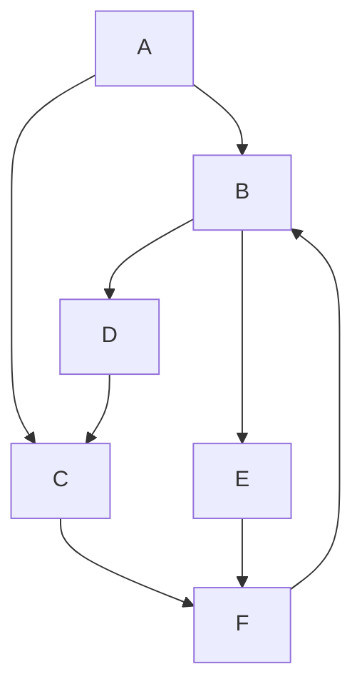

# DFS 2 — Graph (Mermaid)

The graph used in `dfs2.js` as an adjacency list:
- A → B, C
- B → D, E
- C → F
- D → C
- E → F
- F → B (creates a cycle)

Notes
- There is a cycle: A → B → D → C → F → B.
- DFS with a `visited` set prevents infinite loops on such cycles.
